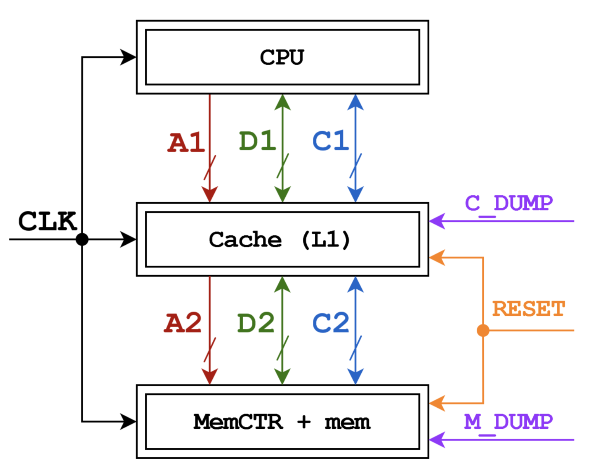

# CPU - Cahce - Memory model on Verilog

The model simulates actual processes that happen
in a PC when we work with memory.

In this model, a one-level LRU cache is used
to store the most recent data used by processor, 
which is connected to the cache by the address (A1), data (D1),
and command (C1) buses;
the memory controller corresponds with the cache via
A2, D2 and C2 buses.

The communication protocol, realization details and
the actual example where we analyse the number
of processor clocks in a simple program can all be found in the 
[description](description.pdf) file

This project was realized as a lab
work in SPbSU MCS
"Computer architecture" course
